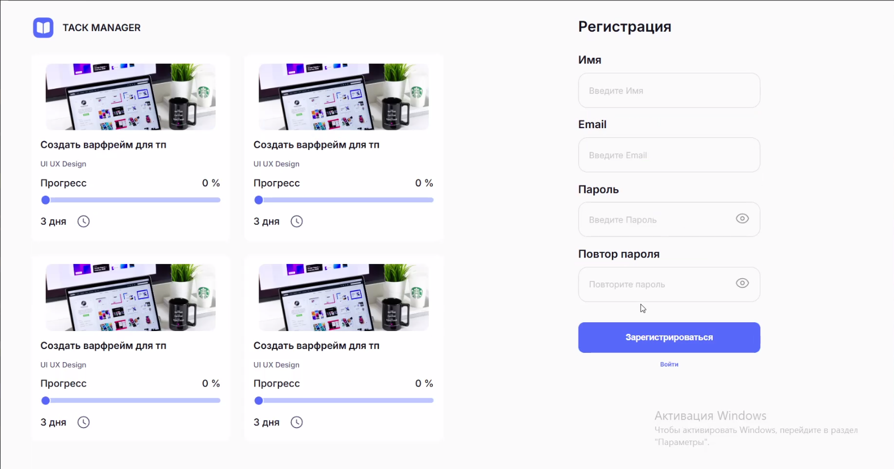
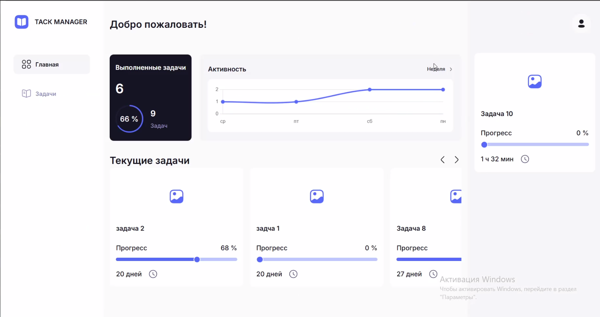
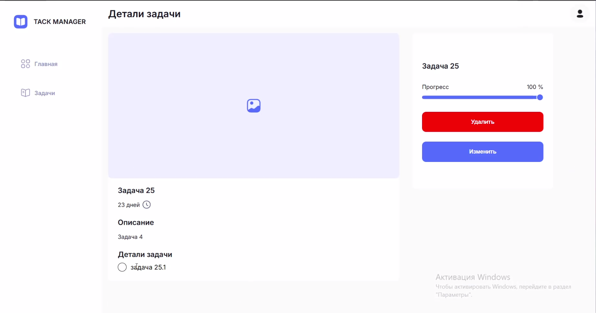
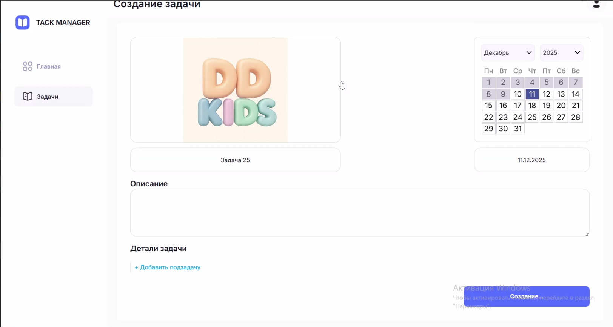

# Task Manager

## 📋 Общее описание

**Task Manager** — это полнофункциональное веб-приложение для управления задачами. Приложение позволяет пользователям создавать, редактировать, отслеживать и организовывать задачи с поддержкой подзадач, прикрепления файлов и аналитики выполнения.

---

## Скриншоты основных экранов



---



---



---



---

## ⚙️ **Функционал**

### 🔐 **Аутентификация и авторизация**
- Регистрация новых пользователей
- Вход в систему (JWT токены)
- Автоматическое обновление токенов
- Безопасный выход из системы

### 📝 **Управление задачами**
- **CRUD операции** для задач
- Установка приоритета (HIGH/MEDIUM/LOW)
- Отслеживание статуса (TODO/IN_PROGRESS/DONE)
- Установка прогресса выполнения (0-100%)
- Назначение дедлайнов с валидацией
- Фильтрация и сортировка задач

### 🎯 **Подзадачи**
- Создание подзадач для основных задач
- Отметка выполнения подзадач
- Редактирование и удаление подзадач

### 📁 **Прикрепление файлов**
- Загрузка фотографий к задачам
- Автоматическая замена старых файлов
- Просмотр загруженных файлов
- Удаление прикрепленных файлов

### 📊 **Аналитика и статистика**
- Отслеживание выполненных задач по дням
- Визуализация продуктивности
- Годовая статистика выполнения

---

## 🚀 **Запуск проекта локально**

### **Предварительные требования**
- Docker и Docker Compose
- Git

### **Шаги для запуска:**

1. **Клонирование репозитория**
```bash
git clone https://github.com/AsadchiyViacheslav/Task_Manager
cd task_manager
```

2. **Запуск через Docker Compose**
```bash
docker-compose up -d
```

3. **Проверка запущенных сервисов**
```bash
docker-compose ps
```

### **Доступ к сервисам:**
- **Frontend**: http://localhost:80
- **Backend API**: http://localhost:8080
- **База данных**: PostgreSQL на localhost:5432


## 🔄 **CI/CD Pipeline**

### **Конфигурация GitHub Actions**
Проект использует автоматизированный пайплайн для сборки и деплоя:

### **Триггеры:**
- При push в ветку `main`
- При создании pull request в ветку `main`

### **Этапы пайплайна:**

1. **Checkout кода**
   - Получение актуального кода из репозитория

2. **Авторизация в Docker Hub**
   - Использование секретов для доступа к Docker Registry

3. **Сборка образов**
   ```yaml
   docker compose -f ./docker-compose.yml build
   ```

4. **Публикация образов**
   - Тегирование образов с timestamp
   - Push образов в Docker Hub репозиторий
   ```bash
   docker tag $IMAGE:latest $DOCKER_USER/$IMAGE_NAME:$IMAGE_TAG
   docker push $DOCKER_USER/$IMAGE_NAME:$IMAGE_TAG
   ```